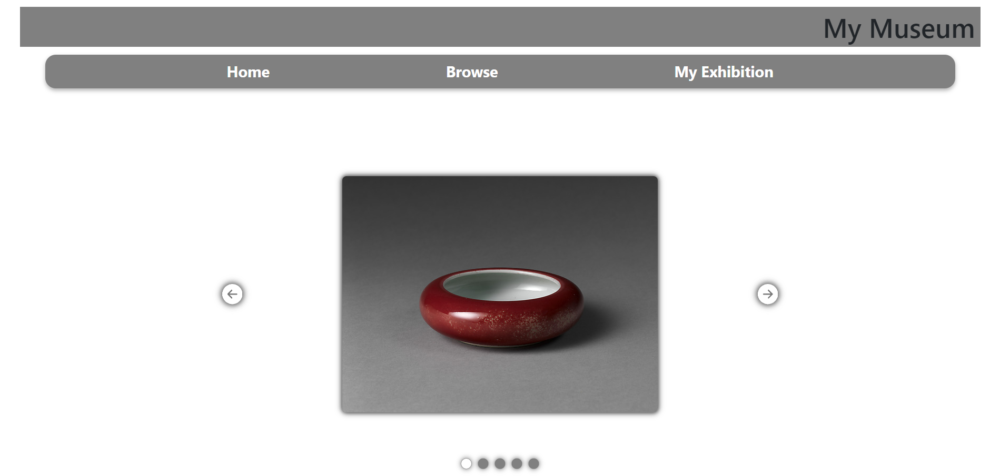

# My Museum

## About

MyMuseum is a website that gathers artwork from the Metropolion Museum and The Harvard Art Museum. Users can browse and search artworks, and then later add artwork to their own personal exhibition which can be viewed on the my exhibition page.

Deployed app can be found here - https://mymuseumapp-kc4wtowo.b4a.run/. Hosted using back4app at https://containers.back4app.com/apps.

Created using Harvards API and The Metropoliton Museums API. Each API uses different keys for the same types of information, for instance to get the date of the piece The Metropolitan Museum stores it under the key ObjectDate and Harvard used Dated, be mindful of this.  
documentation on Harvards API is here - https://github.com/harvardartmuseums/api-docs (YOU WILL NEED TO APPLY FOR AN APIKEY TO USE THEIR API, which you can do here -  https://harvardartmuseums.org/collections/api )
documentation for The Mets API is here - https://metmuseum.github.io/
link to banckend github repo - https://github.com/BeckBob/MyMuseum

### Built With

* React
* Vue

### Installation

1. Clone this repo using 'git clone https://github.com/BeckBob/MyMuseum.git' Create a new public GitHub repository. Do not initialise the project with a readme, .gitignore or license.

2. From your cloned local version of this project you'll want to push your code to your new repository using the following commands:

3. git remote set-url origin YOUR_NEW_REPO_URL_HERE git branch -M main git push -u origin main

4. You'll need to run npm install at this point and then once that is done input npm run dev into your terminal

### Prerequisites

minimum version of node rquired is v20.15.0

(<a href="#readme-top">back to top</a>)

